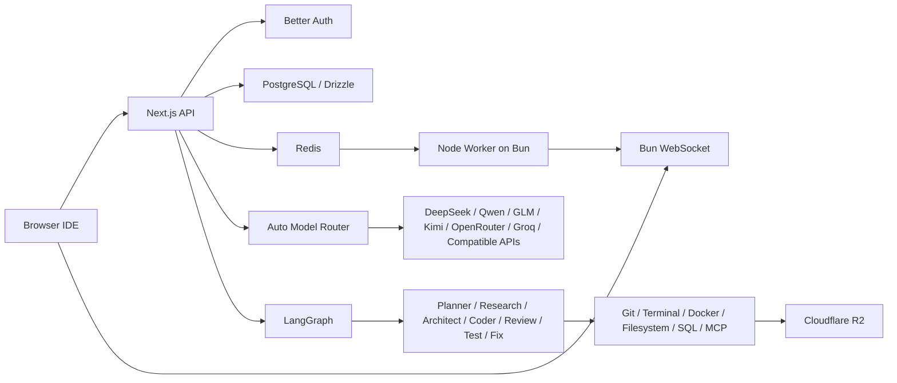

# OpenCodex

OpenCodex is a browser-based AI coding agent inspired by OpenAI Codex, Claude Code, and Cursor Agent. It combines a VS Code-style web IDE, multi-provider model routing, LangGraph multi-agent workflows, GitHub automation, local folder access, cloud sandboxes, MCP connectors, memory, RAG, codebase indexing, tests, security review, and deployment tooling.

## Stack

- Bun.js, Next.js App Router, React, TypeScript, TailwindCSS, shadcn/ui
- Better Auth, Drizzle ORM, PostgreSQL, Redis
- Monaco Editor, xterm.js, WebSocket
- Docker, Cloudflare R2, Git, Node Worker
- LangGraph, MCP Protocol, OpenTelemetry

No Python backend, NestJS, Express, Laravel, Firebase, or Supabase is used.

## Features Included

- Browser IDE with Monaco Editor, multi-tab layout, split-ready panels, minimap, file explorer, terminal, git diff tab, agent chat, model routing, and workflow monitor.
- Local folder access through File System Access API with a desktop-agent path reserved for unsupported browsers.
- Cloud workspace and Docker sandbox specification with persistent storage.
- Git/GitHub automation gateway for clone, commit, push, pull, branch, merge, diff, PR, issue, and discussion workflows.
- Multi-agent roles: Architect, Planner, Coder, Reviewer, Refactor, Debugger, Tester, Security, Documentation, DevOps, Research, Database, Frontend, Backend, Mobile, and API.
- LangGraph workflow: User -> Planner -> Research -> Architect -> Coder -> Review -> Test -> Fix -> Commit -> Deploy.
- Tool catalog for file operations, regex search, git, terminal, Docker, web search, memory, browser, SQL, HTTP, and filesystem.
- MCP connector catalog for GitHub, Notion, Linear, Slack, Discord, Google Drive, Figma, Jira, Confluence, Postgres, Redis, S3, and Cloudflare.
- Memory schema for short, long, project, user, conversation, and semantic retrieval references.
- RAG utilities for README, docs, wiki, PDF text, Markdown, API docs, and source code.
- Codebase index utilities for classes, functions, variables, imports, exports, dependency graph, and reference graph foundations.
- Admin page for users, API usage, billing, logs, providers, workers, queue, and analytics.

## Folder Structure

```text
.
├── src
│   ├── app
│   │   ├── api
│   │   │   ├── agent
│   │   │   ├── auth
│   │   │   ├── providers
│   │   │   ├── rag
│   │   │   ├── tasks
│   │   │   ├── tools
│   │   │   └── workspaces
│   │   ├── admin
│   │   └── page.tsx
│   ├── ai
│   │   ├── code-index.ts
│   │   ├── langgraph.ts
│   │   ├── providers.ts
│   │   ├── rag.ts
│   │   ├── router.ts
│   │   └── tools.ts
│   ├── components
│   │   ├── opencodex
│   │   └── ui
│   ├── db
│   ├── lib
│   ├── mcp
│   ├── types
│   └── workspace
├── workers
├── drizzle
├── docs
├── tests
├── Dockerfile
└── docker-compose.yml
```

## Development

```bash
bun install
cp .env.example .env
docker compose up -d postgres redis
bun run db:generate
bun run db:migrate
bun run seed
bun run dev
```

Worker shells:

```bash
bun run worker
bun run ws
```

Validation:

```bash
bun run typecheck
bun test
bun run build
```

## Environment Variables

See `.env.example` for:

- `APP_URL`, `BETTER_AUTH_SECRET`
- `DATABASE_URL`, `REDIS_URL`
- `R2_ACCOUNT_ID`, `R2_ACCESS_KEY_ID`, `R2_SECRET_ACCESS_KEY`, `R2_BUCKET`, `R2_PUBLIC_URL`
- `GITHUB_CLIENT_ID`, `GITHUB_CLIENT_SECRET`, `GITHUB_APP_ID`, `GITHUB_APP_PRIVATE_KEY`
- `DEFAULT_PROVIDER_BASE_URL`, `DEFAULT_PROVIDER_API_KEY`, `DEFAULT_MODEL`
- `OTEL_SERVICE_NAME`, `OTEL_EXPORTER_OTLP_ENDPOINT`
- `WORKER_SHARED_SECRET`, `WEBSOCKET_PORT`

## Architecture



## Database

The schema lives in `src/db/schema.ts` and covers Better Auth tables, provider credentials, workspaces, code index, memories, conversations, messages, tasks, agent runs, tool calls, MCP servers, GitHub installations, API usage, deployments, and audit logs.

ER diagram: `docs/ERD.md`

## API

API documentation: `docs/API.md`

## Deployment

Deployment notes: `docs/DEPLOYMENT.md`
