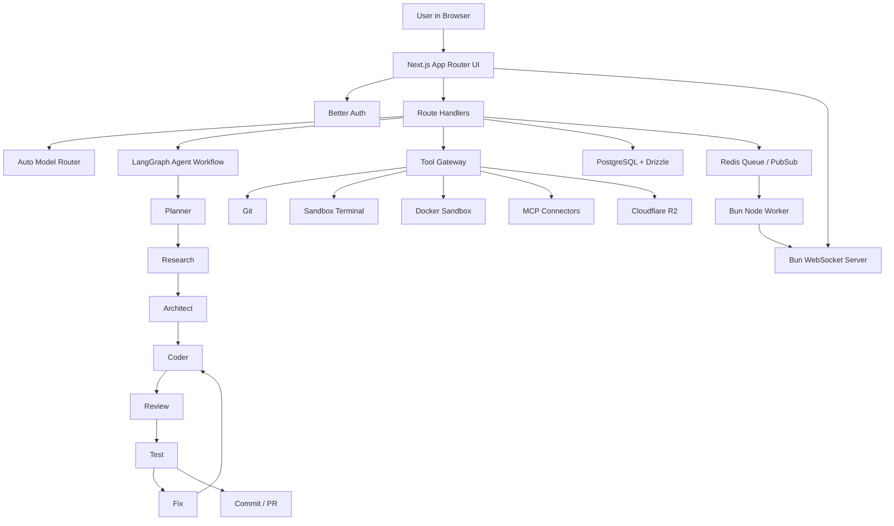
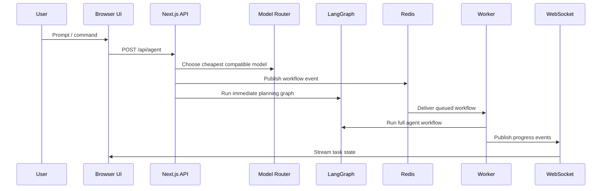

# OpenCodex Architecture

OpenCodex is a browser-first AI coding agent built on Bun, Next.js App Router, React, TypeScript, TailwindCSS, shadcn/ui, Better Auth, Drizzle ORM, PostgreSQL, Redis, Monaco Editor, xterm.js, WebSocket, Docker, Cloudflare R2, Git, Node Worker, LangGraph, MCP Protocol, and OpenTelemetry.

## Runtime Layers

- UI: VS Code-style browser workspace with Monaco, xterm.js, resizable panels, command palette, chat, model routing, and workflow state.
- API: Next.js Route Handlers for auth, agents, providers, workspace indexing, RAG, tasks, MCP, git, and terminal queueing.
- Worker: Bun process that consumes Redis events, runs LangGraph workflows, and publishes live events to WebSocket subscribers.
- Data: PostgreSQL stores users, sessions, credentials, workspaces, code index, memory, conversations, tasks, tool calls, deployments, and audit logs.
- Sandbox: Docker/Linux workspace with persistent storage for cloud IDE execution.
- MCP: Catalog and schema for GitHub, Notion, Linear, Slack, Discord, Google Drive, Figma, Jira, Confluence, Postgres, Redis, S3, and Cloudflare connectors.

## Request Flow

