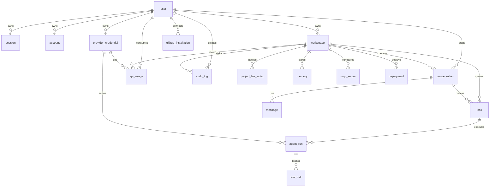

# Database ER Diagram

```mermaid
erDiagram
  user ||--o{ session : owns
  user ||--o{ account : owns
  user ||--o{ provider_credential : owns
  user ||--o{ workspace : owns
  user ||--o{ conversation : starts
  user ||--o{ github_installation : connects
  user ||--o{ api_usage : consumes
  user ||--o{ audit_log : creates

  workspace ||--o{ project_file_index : indexes
  workspace ||--o{ memory : stores
  workspace ||--o{ conversation : contains
  workspace ||--o{ task : queues
  workspace ||--o{ mcp_server : configures
  workspace ||--o{ deployment : deploys
  workspace ||--o{ api_usage : records
  workspace ||--o{ audit_log : audits

  conversation ||--o{ message : has
  conversation ||--o{ task : creates
  task ||--o{ agent_run : executes
  agent_run ||--o{ tool_call : invokes
  provider_credential ||--o{ agent_run : serves
  provider_credential ||--o{ api_usage : bills
```

Core tables are defined in `src/db/schema.ts`.
